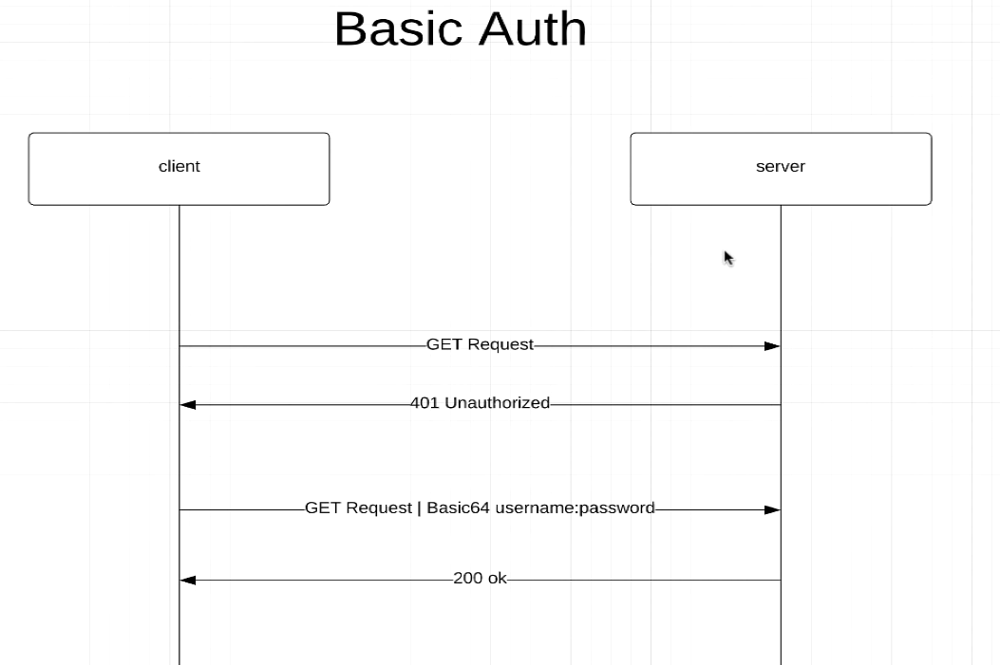

# spring-security
Demo to learn Spring Security

### To Implement Basic Authorization using Spring Security

Let’s suppose a client want to send some requests to a server in order to perform some CRUD operations or to view some data. With basic auth if the client just 
sends a request it will get 401 status code meaning unauthorized from the server. This is because with basic auth you need to specify the username and password inside of 
the request header. So, every single request that a client sends to the server it needs to specify username and password. The username and password is encoded as base64 inside
of the request header then the server does some validations to check whether the user exists and if the user exists it checks the password and then if the password matches that 
the server knows about then the server sends a status code with whatever the client has requested. Basic Auth is actually good when a client has to make some request to an
external APIs.

### Users
Spring Boot Security gives us a default user in which the username is user and the password is 
randomUserId and this user is stored in an In memory database. When you run the application you will get this line in the
console "Using generated security password: a65afcdd-1d21-4428-a48a-d91270afefc2" which is the password for the default user.
But when you develop an application, you will need a bunch of users i.e. users signing up in your application so that you can 
authenticate them as you need. You usually in general case an application will have a lot of users, and then you will 
store them in real database for example MySql, PostgreSql, MongoDB. For a User, it must have a username and this username must 
be unique, it should have a password, and it must be encoded. Then with users we can define roles using authorities.
